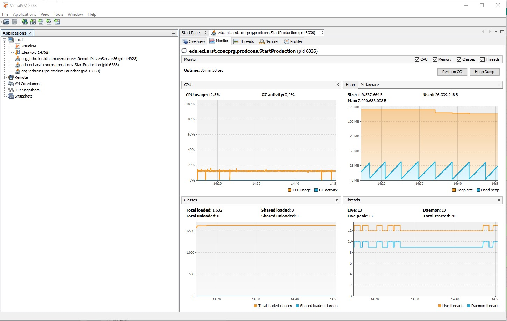
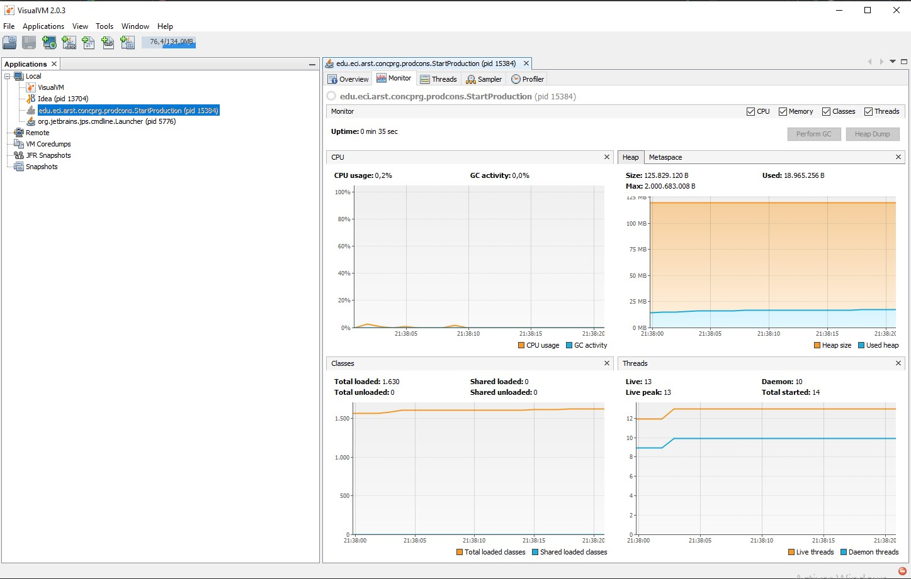
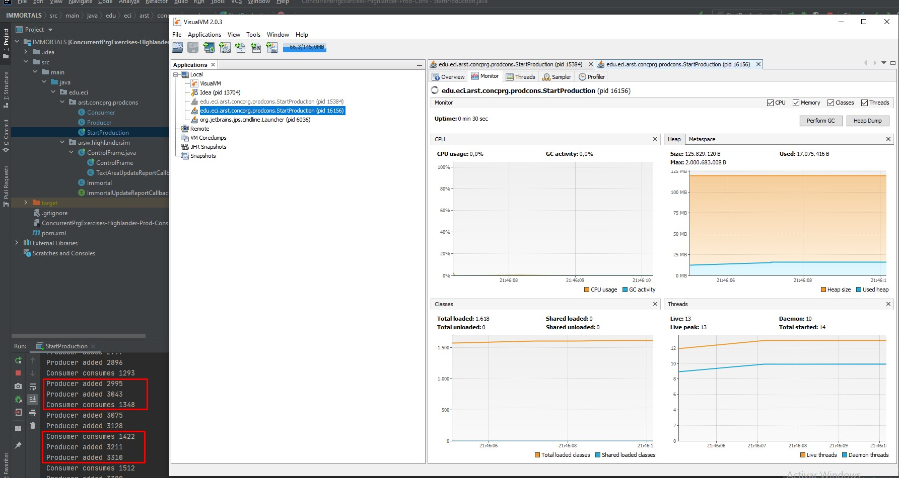
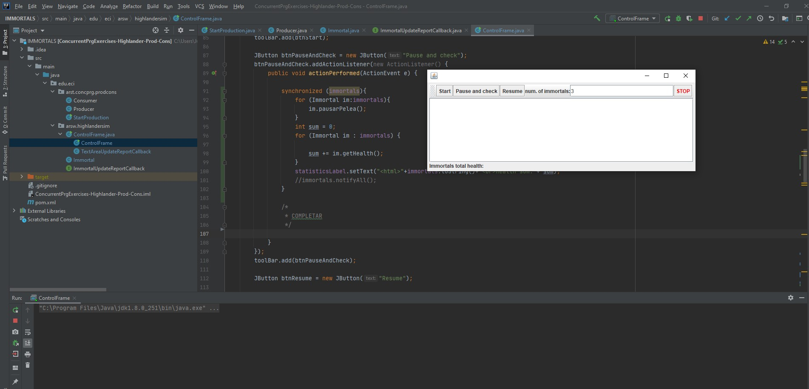
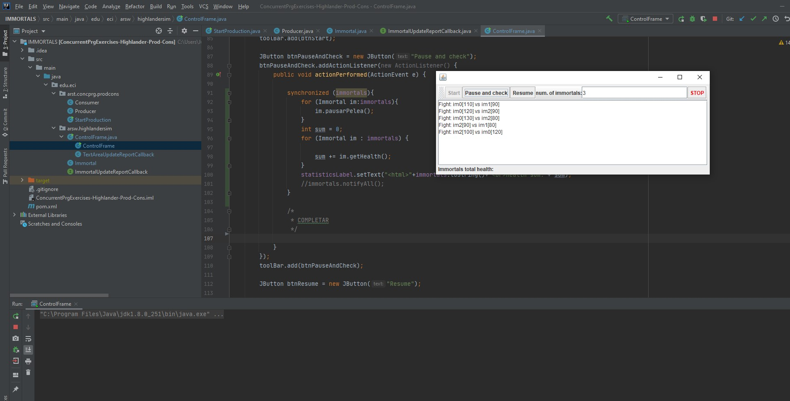
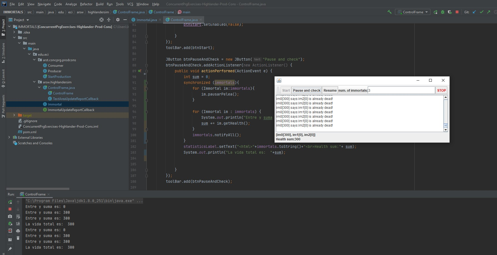
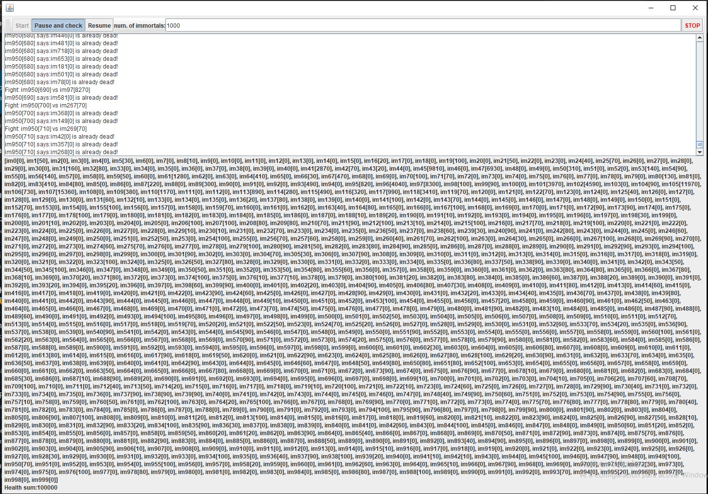
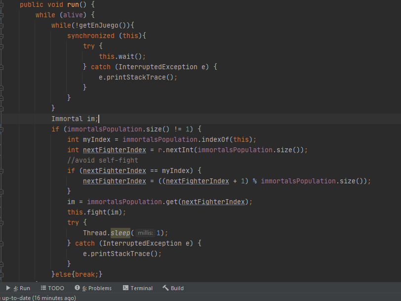
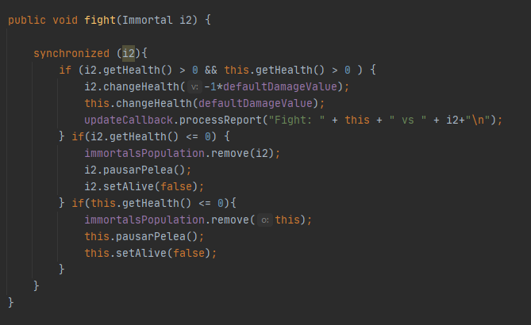
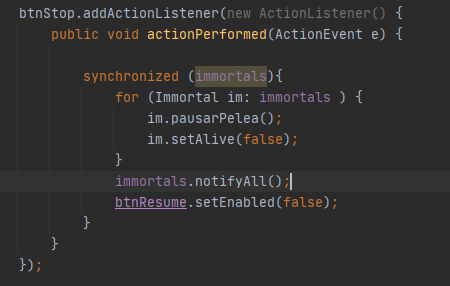

# ARSW_LAB2

### JAVA IMMORTALS

## Part I - Before finishing class

. Check the operation of the program and run it. While this occurs, run jVisualVM and check the CPU consumption of the corresponding process. Why is this consumption? Which is the responsible class? 

Make the necessary adjustments so that the solution uses the CPU more efficiently, taking into account that - for now - production is slow and consumption is fast. Verify with JVisualVM that the CPU consumption is reduced. 

Make the producer now produce very fast, and the consumer consumes slow. Taking into account that the producer knows a Stock limit (how many elements he should have, at most in the queue), make that limit be respected. Review the API of the collection used as a queue to see how to ensure that this limit is not exceeded. Verify that, by setting a small limit for the 'stock', there is no high CPU consumption or errors.

_______________________________________________________________________________________________________________

## Part II-Synchronization and Dead-Locks.

Imortal
Review the “highlander-simulator” program, provided in the edu.eci.arsw.highlandersim package. This is a game in which:

2- Review the code and identify how the functionality indicated above was implemented. Given the intention of the game, an invariant should be that the sum of the life points of all players is always the same (of course, in an instant of time in which a time increase / reduction operation is not in process ). For this case, for N players, what should this value be?

3- Run the application and verify how the ‘pause and check’ option works. Is the invariant fulfilled?

A first hypothesis that the race condition for this function (pause and check) is presented is that the program consults the list whose values ​​it will print, while other threads modify their values. To correct this, do whatever is necessary so that, before printing the current results, all other threads are paused. Additionally, implement the ‘resume’ option.

Once the problem is corrected, rectify that the program continues to function consistently when 100, 1000 or 10000 immortals are executed. If in these large cases the invariant begins to be breached again, you must analyze what was done in step 4.

10. An annoying element for the simulation is that at a certain point in it there are few living 'immortals' making failed fights with 'immortals' already dead. It is necessary to suppress the immortal dead of the simulation as they die. 

    + Analyzing the simulation operation scheme, could this create a race condition? Implement the functionality, run the simulation and see what problem arises when there are        many 'immortals' in it. Write your conclusions about it in the file ANSWERS.txt. 
    
    + Correct the previous problem WITHOUT using synchronization, since making access to the shared list of immortals sequential would make simulation extremely slow. 

NOTA: Estas respues se encuentran [aquí](https://github.com/JuanManuelHerreraMoya/ARWS_LAB2/blob/master/ANSWERS) o en el archivo ASNWERS.txt que esta al principio.

De acuerdo a lo que plantemos en ANSWERS.txt, cambiamos el run ya que usamos una lista concurrente que provee java, entonces ya no necesitamos sincronizar pero si comprobar que los jugadores esten vivos, para ello si usamos variables atomicas.

_____________________________________________________________________

Aca vemos como healt paso a ser una variable atomica y de paso revisa que los jugadores esten vivos, con el fin de que al ser eliminados de la lista no afecte esta variable.

_____________________________________________________________________

11. To finish, implement the STOP option.

Detenemos los hilos y desactivamos el boton de resume, para que al darle en pause and check pueda ve los resultados si no lo oprimio con anterioridad

## Grade Criteria
The deliver of this workshop should be a link to GitHub repository where the README file contains all the answers (you can use images to support your solution development) and the source code is the solution.

The README file should contains:

Compile and run instructions.

Answers to all the workshop questions. 

Another grade criteria will be:

Use of Maven.

Use of GitHub.

Include your own tests.

Part I

Functional: The production / consumer simulation runs efficiently (without active waiting).

Part II

Design:

Thread coordination:

To pause the fight, the main thread must be induced to induce others to suspend themselves. It should also be borne in mind that only the sum of life points should be shown when it is ensured that all threads have been suspended.

If the entire set of threads is covered for the above to see its status, it is evaluated as R, because it is very inefficient.

If for the above the threads manipulate a counter concurrently, but do so without taking into account that the increase of a counter is not an atomic operation -that is, it can cause a race condition-, it is evaluated as R. In this in case you should synchronize access, or use atomic types like AtomicInteger).

Consistency before the concurrence

To ensure consistency in the fight between two immortals, access to any other fight that involves one, the other, or both simultaneously must be synchronized:

In the nested synchronization blocks required for the above, it must be guaranteed that if the same locks are used in two fights simultaneously, they will be used in the same order to avoid deadlocks.

In case of synchronizing the access to the fight with a common LOCK, it will be evaluated as M, since this makes all the fights sequential.

The list of immortals should be reduced as they die, but this operation must be carried out WITHOUT synchronization, but using a concurrent (non-blocking) collection.

Functionality:

The invariant is met when using the application with 10, 100 or 1000 wires.

The application can resume and end (stop) its execution.
